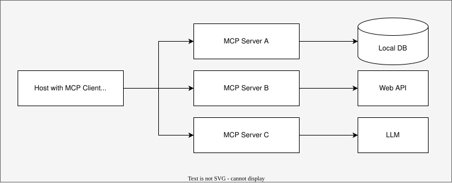
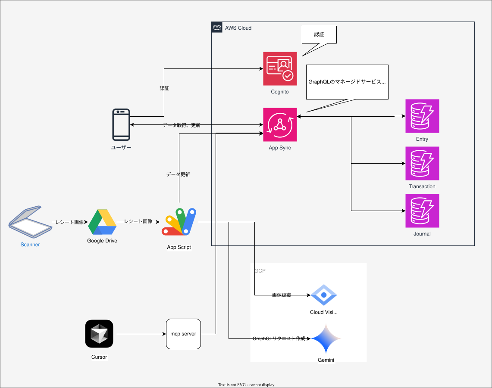
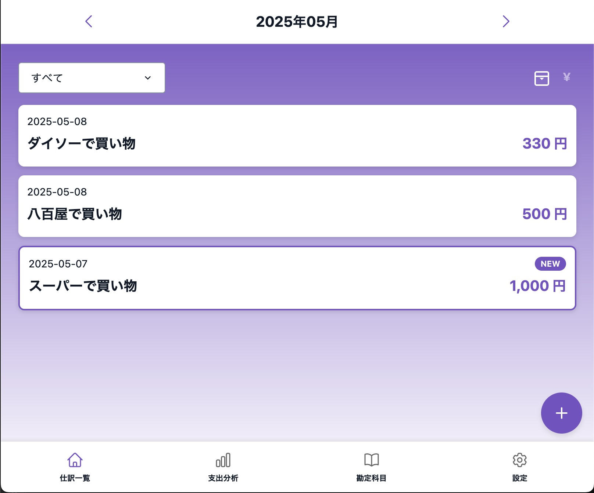
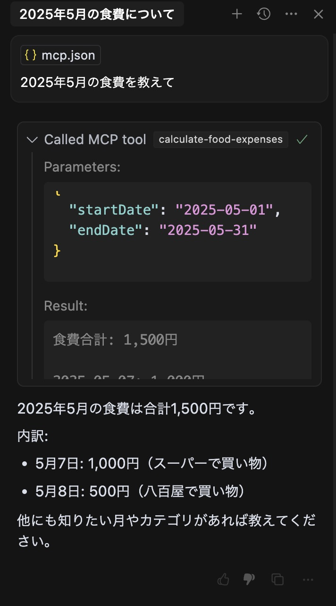

## MCPとは？
- MCP = Model Context Protocol
- AIモデルと外部ツール・データソースと接続する仕組み
  - 接続先: ローカルDB, Web API(天気予報, Slack, Confluence, ...), 他のLLM
- AIアプリのUSB-Cとも言われる
  - 様々な周辺機器が共通のインタフェースで接続されることとの類似性
- LSP(Language Server Protocol)にインスパイアされ、Host-Client-Serverの三層構成、JSON-RPC 2.0が採用されている



## 主なユースケース
- データベースを自然言語でクエリ
- Notionのデータを読み込む
- GitHUbのPull Requestを作成する
- Stripe(PaymentのSaaS)の顧客管理する
- メモリ拡張（情報の記憶・呼び出し）

## RAGとの違い
- RAG(Retrieval-Augmented Generation)は、「検索 + 生成」で外部知識を注入する設計パターン。本質はベクトルDBの類似度検索。

| 観点 | MCP | RAG |
|---|---|---|
| 役割 / スコープ | LLMが外部ツール・データソースを呼び出すための通信規格（USB-C的ハブ） | LLMに外部知識を注入して回答精度を上げる設計パターン |
| 代表ユースケース | 操作系：<br>　- 住民税を計算する関数を実行<br>　- Jira発行APIをたたく<br>クエリ系：<br>　- DynamoDBから家計簿合計を取得<br>　- IoTデバイスの最新ログを取得<br>| Q&A／チャット検索：<br>　- 社内Wiki・マニュアルを参照して回答<br>ドキュメント要約：<br>　- 長文PDFを分割検索し要約<br>コード補完：<br>　- リポジトリ全体を検索→提案 |
| メリット | 既存の業務システムやAPIと柔軟に連携できる<br>リアルタイムな操作やデータ取得が可能<br>ベクトルDBの構築が不要 | 非構造データ（文書・コード等）から柔軟に知識を抽出できる |

## LangChainとの関係
- LangChainは、LLM ワークフロー／エージェントを組む開発フレームワーク
- 最近LangChain MCP AdaptersというMCPを使うための薄いWrapperモジュールが登場し、両者が統合可能になった
  - MCPはLangChainから使われるツールの位置づけ
  - LangChainは、MCPにおけるホストの位置づけ

## MCPクライアント-サーバー間の接続方式
- 標準入出力(stdio)
  - クライアントがMCPサーバーをサブプロセスとして起動し、標準入出力でやり取りする
  - 単一クライアントのみ対応
  - 基本はこちらが使われている
- HTTP with Server-Sent Events(SSE)
  - リモート接続
  - クライアントからサーバーへのメッセージ送信
  - サーバーからクライアントへのストリーミング通知
  - ChatGPTで回答が断片的に表示されるアレ
  - マルチクライアント対応

[Super Gateway](https://github.com/supercorp-ai/supergateway)のように、これらを相互に変換するツールも存在する

## MCPサーバー実装
https://github.com/modelcontextprotocol/typescript-sdk
```
import { McpServer, ResourceTemplate } from "@modelcontextprotocol/sdk/server/mcp.js";
import { StdioServerTransport } from "@modelcontextprotocol/sdk/server/stdio.js";
import { z } from "zod";

// Create an MCP server
const server = new McpServer({
  name: "Demo",
  version: "1.0.0"
});

// Add an addition tool
server.tool("add",
  { a: z.number(), b: z.number() },
  async ({ a, b }) => ({
    content: [{ type: "text", text: String(a + b) }]
  })
);

// Start receiving messages on stdin and sending messages on stdout
const transport = new StdioServerTransport();
await server.connect(transport);
```

### 機能1: Resources
副作用のないリソース情報を提供する
```
server.resource(
  "config",
  "config://app",
  async (uri) => ({
    contents: [{
      uri: uri.href,
      text: "App configuration here"
    }]
  })
);
```

### 機能2: Tools
副作用のあるアクションや計算を提供する
```
// Simple tool with parameters
server.tool(
  "calculate-bmi",
  {
    weightKg: z.number(),
    heightM: z.number()
  },
  async ({ weightKg, heightM }) => ({
    content: [{
      type: "text",
      text: String(weightKg / (heightM * heightM))
    }]
  })
);

// Async tool with external API call
server.tool(
  "fetch-weather",
  { city: z.string() },
  async ({ city }) => {
    const response = await fetch(`https://api.weather.com/${city}`);
    const data = await response.text();
    return {
      content: [{ type: "text", text: data }]
    };
  }
);
```

### 機能3: Prompts
LLM へ渡す会話を 1 メッセージだけ作る。LLMと対話しやすいようなテンプレート。
```
server.prompt(
  "review-code",
  { code: z.string() },
  ({ code }) => ({
    messages: [{
      role: "user",
      content: {
        type: "text",
        text: `Please review this code:\n\n${code}`
      }
    }]
  })
);
```

## クライアント実装
```
import { Client } from "@modelcontextprotocol/sdk/client/index.js";
import { StdioClientTransport } from "@modelcontextprotocol/sdk/client/stdio.js";

const transport = new StdioClientTransport({
  command: "node",
  args: ["server.js"]
});

const client = new Client(
  {
    name: "example-client",
    version: "1.0.0"
  }
);

await client.connect(transport);

// List prompts
const prompts = await client.listPrompts();

// Get a prompt
const prompt = await client.getPrompt({
  name: "example-prompt",
  arguments: {
    arg1: "value"
  }
});

// List resources
const resources = await client.listResources();

// Read a resource
const resource = await client.readResource({
  uri: "file:///example.txt"
});

// Call a tool
const result = await client.callTool({
  name: "example-tool",
  arguments: {
    arg1: "value"
  }
});
```

## セキュリティリスクや課題
- 認証情報の漏洩
  - MCPサーバーは外部サービスの認証情報を保有するため、攻撃対象にされやすい
- コマンドインジェクション
  - サーバー上で任意のコマンドを実行されるリスク
- プロンプトインジェクション
  - データ漏えいや不正利用のリスク
- 認証、通信の暗号化の欠如
- AIの誤動作


## デモ
自作家計簿アプリに対して、Cursorから自然言語でクエリする


<div style="display: flex; gap: 1rem; align-items: flex-start; padding: 1rem 0;">
  
  
</div>
